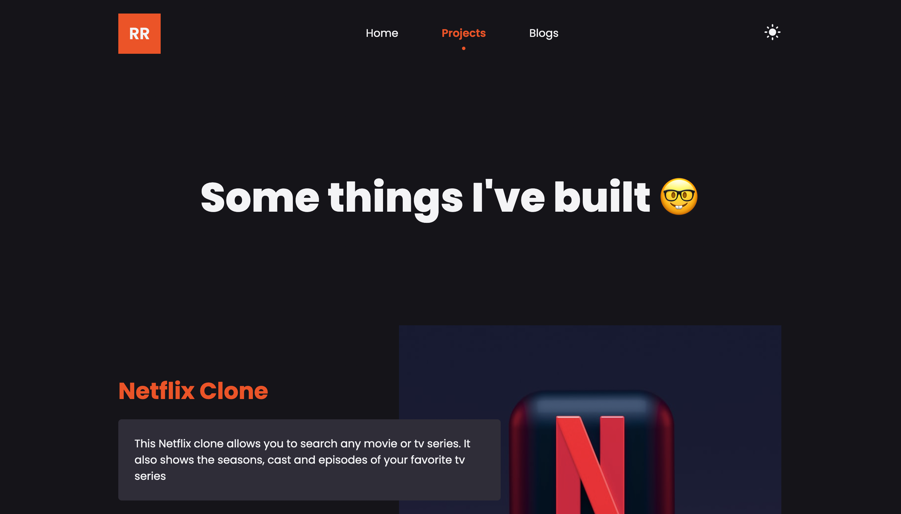

## 🛠 Installation

1. Install & setup **nvm** (Node Version Manager) on your machine. [Here's how to setup on Mac](./documentations/setup_nvm.md)
1. Install & use the correct version of NodeJS for this project using NVM

    ```
    nvm install
    ```

1. Install dependencies by running the command `npm install` or `yarn`
1. Start the developement server by running the command `npm run dev` or `yarn dev`

    Open [http://localhost:3000](http://localhost:3000) with your browser to see the result.

## 🚀 Building and Running for Production

Generate a full static production build

```
npm run build
```

Preview the site as it will appear once deployed

```
npm run serve
```
